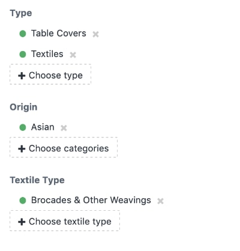

# Faceted Navigation plugin for Craft CMS 3.x/4.x/5.x

Provides faceted navigation of entries, using categories, which allows site users to narrow the list of entries they see by applying multiple facets (think Amazon or eBay left sidebar).

Adapted with permission from its original author, the incomparable Iain Urquhart (http://iain.co.nz)

## Requirements

This plugin requires Craft CMS 3.0.0-beta.23 or later, Craft CMS 4.0.0-alpha.1 or later, or Craft CMS 5.x or later.

## Installation

To install the plugin, follow these instructions.

### Craft Plugin Store

Locate Faceted Navigation in the plugin store and click install

### Manual Installation

1. Open your terminal and go to your Craft project:

        cd /path/to/project

2. Then tell Composer to load the plugin:

        composer require helloswish/craft-faceted-navigation

3. In the Control Panel, go to Settings → Plugins and click the “Install” button for Faceted Navigation.

### Settings

Version 1.1.1 introduced a single setting in the Control Panel, which allows you to choose if users can select multiple filters per filter group. By default, users can _not_ select multiple filters per filter group.

## Faceted Navigation Overview

This plugin provides the functionality necessary to implement faceted navigation on a site built with Craft CMS 3 or 4. To read more about faceted navigation, check out this [2010 A List Apart article](https://alistapart.com/article/design-patterns-faceted-navigation/).

You can see examples of this plugin in action, and try it out, on the following sites:

- [The Lotus Collection](https://ktaylor-lotus.com/inventory)
- [Stemple Creek Ranch](https://stemplecreek.com/shop)

The plugin provides the following functionality:

- Ability to use a single category group, or multiple category groups for filtering
- Ability to add as many categories as the user likes to filter the list of entries
- Add and Remove links for each category to add or remove the category from the list of categories being provided to the entries query to filter on
- A list of currently added categories, with remove links, that can be shown independently of the full categories list
- Ability to provide either AND or OR filtering with multiple facets (only one or the other for all facets applied, not a combination of AND and OR)
 
*Note: this plugin will only work with category groups that use 1 level of categories.*

## Screenshots


## Implementing Faceted Navigation

I'll be using The Lotus Collection (linked above) implmentation to demonstrate how to setup the plugin.

### 1. Add Route

Add this route to your config/routes.php file:

`'inventory/<path:.*?>' => ['template' => 'inventory/index']`

*(this example assumes the faceted navigation will be located at https://domain.com/inventory and the template that is shown for that url is located in your Craft templates folder at inventory/index)*

This route will ensure that all requests that begin with *inventory* and include any number of facets in the url will be directed to the correct template. All other implementation is done in your template code.

### 2. Setup Channel, Categories, Fields, and Entries

*Note: this plugin will only work with category groups that use 1 level of categories.*

Create a channel for your entries in the Craft Control Panel. For this example, we'll call it *Inventory*.

Create one or more category groups in the Craft Control Panel. For The Lotus Collection, I created 3 groups. The handles are `productType`, `productOrigin`, and `textileType`.


Add your categories to each group. 

Create category fields, one for each category group, and assign them to your inventory channel.


Add your entries, and assign all the appropriate categories to them.



### Template Code

Calling `craft.facetedNavigation.buildFacets` allows you to render your navigation sets and output current filters, as well as build a parameter for your main craft.entries call when outputting your entries.

**Basic Tag Set**

At or near the top of your inventory/index template, paste in the basic set tag, along with an array of your category group handles. We'll also setup the `relationParam` variable, which can be AND or OR, depending on how you want your facets to filter your entries query. Finally, we'll setup a `params` array to feed into our entries query later.

```



```

You should add other craft.entries parameters to the params array here, as we'll be appending to it later.

**Output Category Facets**

In order to apply categories as facets on your entry query, you need to first display the categories in your template. Those categories must be linked so that when clicked, they are each added to the group of categories being used to filter the entries query. When a category is currently added, a remove link can be displayed.

```

	<h3>{{ categoryGroup.name }}</h5>
	<ul>
		
			<li class="active">
				<a href="{{ url('inventory'~category.url.add) }}" class="add">{{ category.title}}</a>
				 <a href="{{ url('inventory'~category.url.remove) }}" class="remove" title="Remove this filter">Remove</a> 
			</li>
		
	</ul>

```

A few notes about the above code:

- This will loop through all category groups that you provided to the basic tag set (above). Then within each group, it loops through and displays the categories.
- `category.active` is a boolean that is `true` if the category is currently applied.
- `category.url.add` creates the link to add the category. Use `{{ url('inventory'~category.url.add) }}` to create the link.
- `category.url.remove` creates the link to remove the category. Use `{{ url('inventory'~category.url.remove) }}` to create the link.

**Output Currently Added Categories**

You may want to show a list of currently applied facets. This is also a good place to build our `relatedTo` variable, which will become a parameter for the craft.entries query.

```

	<nav>
		<h4>Viewing items in these categories:</h4>
		<ul>
		
			
			<li>{{ category.title }} <a href="{{ url('inventory'~category.url.remove) }}">Remove</a></li>
		
		</ul>
	</nav>

```

A few notes about the above code:

- `` tests to see if there are currently added categories. If not, this entire block of code is skipped.
- `` adds another parameter to the `relationParam` array that we set anove in the basic tag set. For each added category, another parameter is added to that array.
- We're again using `{{ url('inventory'~category.url.remove) }}` to create the remove link.

**Run the Entries Query**

We've now collected all the parameters we need to feed into craft.entries:

```

    




    ...

```

A note about the above code:

- We're only merging the `relationParam` array into the `params` array (set at the top in the basic tag set) if there are any added categories. Otherwise the craft.entries query only gets the parameters set initially on that array, which, in this example, is the section handle  `inventory `.

**Full Code Example**

Here is the full code I used on The Lotus Collection site. It includes surrounding HTML and other Craft functionality:
[https://gist.github.com/chadcrowell/890e78f7af38e02d5ba1bcd497d1441c](https://gist.github.com/chadcrowell/890e78f7af38e02d5ba1bcd497d1441c)

------

*Brought to you by [Swish Digital](https://swishdigital.co)*
